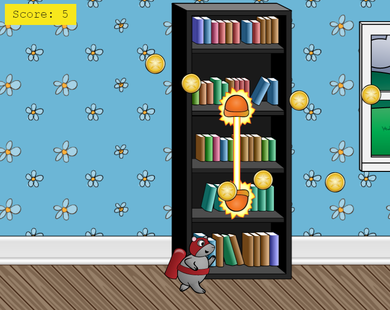

# Phaser 3 Webpack 5 TypeScript Boilerplate

Get up and running with Phaser 3 using TypeScript or JavaScript ES6.

This Webpack setup takes care of your code bundling and local development server.



## Installation

Ensure you have [Node.js](https://nodejs.org) installed.

Clone this repository and `cd` to project directory.

```
npm i
```

## Tasks

### Run the development server

```
npm start
```

Preview locally at http://localhost:8080/.

### Create a production build

```
npm run build
```

This bundles your files to the distribution (`/dist`) folder. The webpack config is set up to output Phaser and your game code into separate .js files.  

### Deploy GitHub page

```
npm run deploy
```

The contents of the "dist" folder will be deployed to GitHub Pages.
Please modify the URL in the "homepage" field of the package.json as needed.

package.json
```json
{
  "name": "phaser3-webpack-starter-ts",
  "homepage": "https://atman-33.github.io/phaser3-webpack-starter-ts",
  ...
```


## Reference

[Infinite Runner (GitHub)](https://github.com/ourcade/infinite-runner-template-phaser3/blob/master/readme.md)